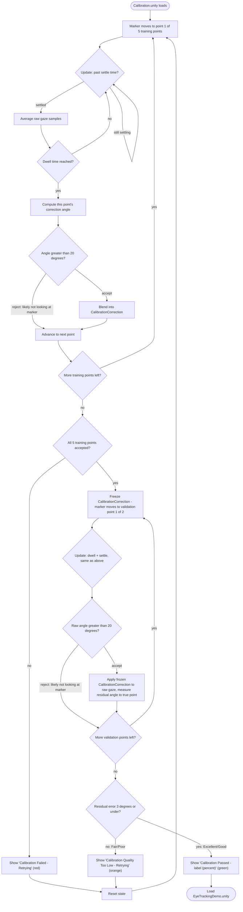

# Eye Tracking Unity Demo

This project is a fork of [Pico's official EyeTrackingDemo sample](https://github.com/picoxr/EyeTrackingDemo)
(their native Pico SDK eye-tracking demo, not OpenXR), extended here for standalone eye-tracking learning and prototyping on a PICO 4 Enterprise headset.

## What was added in this project

- **5-point rotational gaze calibration**, with pass/fail validation, automatic retry, and a
  plain-language quality score - runs in its own `Calibration.unity` scene before the main demo
  loads. Full write-up in [User Calibration](#user-calibration) below, code in
  [`CalibrationManager.cs`](Assets/Scripts/CalibrationManager.cs).
- **Gaze-driven heatmap prototype**, stamping heat onto an object's surface wherever the user
  looks, with brush size auto-scaled to that object's real physical size:
  [`MeshGazeHeatmap.cs`](Assets/Scripts/MeshGazeHeatmap.cs).
- **Per-object dwell-time report**, replacing the original live gaze-vector readout with an
  accumulating "seconds looked at each object" report, in
  [`EyeTrackingManager.cs`](Assets/Scripts/EyeTrackingManager.cs).
- Fixes required to get the original sample building, deploying, and eye-tracking correctly on a
  PICO 4 Enterprise headset (stale package reference, corrupted Android debug keystore, runtime
  eye-tracking permission grant, Built-in vs URP shader mismatch, mesh Read/Write import setting).

Everything from here down is the original Pico sample's documentation, with the **User
Calibration** section rewritten to describe the rebuilt system above; **3D models** and **Avatar**
are unmodified from the original sample.

## Environment：

- PUI 5.4.0
- Unity 2021.3.13f1
- Pico Unity Integration SDK 2.1.4

## Applicable devices:

- PICO 4 Pro
- PICO 4 Enterprise

## Description：
To enable eye tracking feature you need to mark the Eye Tracking check box on PXR_Manager:

- There are 3 parts in this project. A spot light is used to show an approximate eye gaze area.

### User Calibration
*Rebuilt for this project - see [What was added](#what-was-added-in-this-project) above.*

**What this does:** every headset's eye tracking has a small natural offset, before you can use
the app, it asks you to look at 5 dots shown one at a time. It measures how far off your gaze was
from each dot and learns a correction for it - then checks its own work by testing the correction
against 2 more dots it never used to learn from. If that re-check comes back too imprecise, it
automatically tries the whole thing again on its own - you don't need to do anything. Only once
it genuinely passes that quality check do you see a green pass message with a score from 0-100%
(higher is better), and get taken straight into the main demo.

There's no limit on how many times it will retry - this project favors an accurate result over a
fast one, so seeing several orange "retrying" messages in a row is expected, not a sign anything
is broken. If it retries for an unusually long time, that's more likely a headset fit issue (try
readjusting it) than a software problem.

**Technical details** (implementation): runs in a dedicated `Calibration.unity` scene, before the
main demo loads, correcting for ANGULAR bias in the raw eye-tracking data (the tracker's estimate
of gaze direction being consistently off by a small rotation). Code:
[`Assets/Scripts/CalibrationManager.cs`](Assets/Scripts/CalibrationManager.cs).

**Flow:**

**Key thresholds:**

| Value | Purpose | Basis |
|---|---|---|
| ~16°-28° | Spacing between the 5 target points | Geometry of `calibrationPointLocalOffsets` - a fact about the layout, not a tuned threshold |
| 20° (`maxPlausiblePointCorrectionDegrees`) | Per-point rejection - is this point's data even usable? | Heuristic: comfortably above real tracking bias/noise, comfortably below "not looking at the marker at all" |
| 1.5° / 3° / 5° | Quality label bands (Excellent/Good/Fair/Poor); **3° also gates retry** - only Excellent/Good proceed | Judgment call, not yet independently validated for this device - see [Open question](#open-question-validating-the-quality-bands-scientifically) below |

Two separate gates - failing either one retries from scratch, no app restart needed:

**Gate 1 - training data validity:** requires all 5 training points to collect valid data
(`RecordCurrentPointCorrection` rejects a point outright if its correction angle exceeds 20°,
same as an eye-tracking dropout). Fail here shows red `"Calibration Failed - Retrying..."`.

**Gate 2 - measured quality** (the interesting one): on passing gate 1, `CalibrationCorrection`
is frozen and the marker moves through 2 more points (`validationPointLocalOffsets`) that were
**never** used to build the correction. Each one first passes through the *same* 20°
"were-they-looking-at-it" rejection check the training points use (checked on the raw, uncorrected
angle - a glance-away during validation shouldn't corrupt the very number this feature exists to
make honest); if accepted, `RecordValidationResidual` applies the now-frozen correction to that
point's raw gaze and measures how far off the *corrected* result still is from the true direction
- a train/test split, not a number measured on the same points used to fit it (which would be
optimistically biased). If both validation points get rejected (rare), the quality gate below
falls back to the training-set bias rather than showing a misleading 0°/100%.

That residual error becomes the label + 0-100% score
(`GetBiasQualityLabel`/`GetBiasQualityPercent`, linearly mapped from 0° = 100% to the 5° "Poor"
ceiling, `PoorBiasCeilingDegrees`) - and gates progression: only Excellent/Good (residual ≤3°,
`GoodBiasCeilingDegrees`) proceeds. Fair/Poor shows orange `"Calibration Quality Too Low -
Retrying..."` and restarts from point 1, uncapped by design - for a precision-sensitive use case,
an accurate result matters more than a fast one. `adb logcat` shows both the residual and the
training-set bias side by side (e.g. `Residual error=2.1° (Good, 58%) - training-set bias was
0.9° for comparison`) so you can see how much the training-only number would have overstated
accuracy.

**Cross-scene handoff:** `CalibrationCorrection`/`IsCalibrated` are `static` fields - held in
memory only, reset every launch (multiple people may share the headset). On pass,
`SceneManager.LoadScene()` replaces `Calibration.unity` with `EyeTrackingDemo.unity`, and
`EyeTrackingManager.cs` reads `CalibrationManager.CalibrationCorrection` directly each frame.

#### Open question: validating the quality bands scientifically

The 1.5°/3°/5° bands themselves are still a judgment call - but the *number they're applied to*
is now real, device-specific measured data instead of a borrowed benchmark. Status:

1. **Holdout validation points - implemented.** The 2 validation points above measure residual
   error on data `CalibrationCorrection` was never fit on, on this actual headset, every time
   someone calibrates. This is what makes the quality score trustworthy as a *relative* signal
   (better/worse between runs) even before the *absolute* band cutoffs are independently checked.
2. **Precision (self-consistency) check - not yet implemented.** Alongside bias, track the
   *spread* of raw samples collected during each point's settle window, not just their average.
   A tight cluster of samples is evidence of a stable, trustworthy correction independently of
   any external accuracy benchmark.
3. **Derive the bar from actual task requirements - not yet implemented.** Instead of asking
   "what accuracy do other headsets achieve," compute the angular size of the smallest object
   this project needs the user to reliably select (using the same object-size logic already in
   [`MeshGazeHeatmap.cs`](Assets/Scripts/MeshGazeHeatmap.cs)), and set "good enough" relative to
   that - a functional requirement instead of a hardware comparison.
4. **Accumulate real first-party data - not yet implemented.** Now that every calibration run
   produces a real residual-error measurement (#1 above), logging and aggregating those across
   multiple people/sessions on this actual headset would let the 1.5°/3°/5° cutoffs themselves
   be set from a real, device-specific distribution instead of a judgment call.

### 3D Models
*Original Pico sample, unmodified.*

**What this does:** two 3D objects in the scene (a cube and an animated character) react when you
look at them - they visually highlight to show they're "focused," and un-highlight the moment
you look away. Implementation: derive from `ETObject` and implement `IsFocused()`/`UnFocused()`.

### Avatar
*Original Pico sample, unmodified.*

**What this does:** a virtual avatar's eyes blink and open/close in sync with your own real
blinking, read directly from the headset's eye-tracking sensors. Implementation:
`PXR_EyeTracking.GetLeftEyeGazeOpenness`/`GetRightEyeGazeOpenness`.

