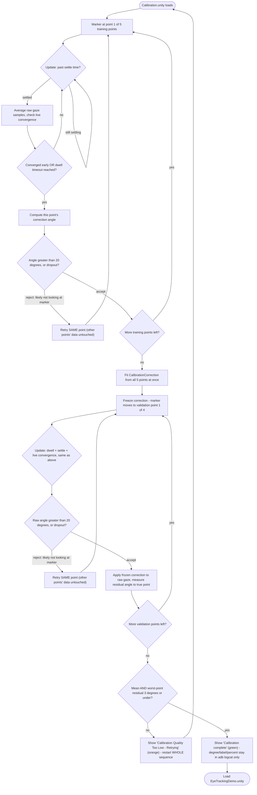
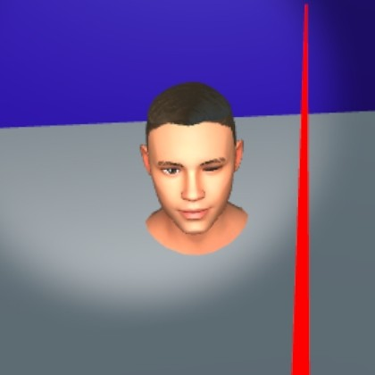

# Eye Tracking Unity Demo

This project is a fork of [Pico's official EyeTrackingDemo sample](https://github.com/picoxr/EyeTrackingDemo)
(their native Pico SDK eye-tracking demo, not OpenXR), extended here for standalone eye-tracking learning and prototyping on a PICO 4 Enterprise headset.

## What was added in this project

- **Live headset-fit guide**, shown before calibration even starts - two on-screen dots track
  each eye's real-time position relative to the sensor, so a bad fit can be corrected before it
  ever affects calibration. Runs in its own `PositionGuide.unity` scene, first in the launch
  order. Full write-up in [Head Position Guide](#head-position-guide) below, code in
  [`PositionGuideManager.cs`](Assets/Scripts/PositionGuideManager.cs).
- **5-point rotational gaze calibration**, with pass/fail validation, automatic retry, and a
  plain-language quality score - runs in its own `Calibration.unity` scene before the main demo
  loads. Full write-up in [User Calibration](#user-calibration) below, code in
  [`CalibrationManager.cs`](Assets/Scripts/CalibrationManager.cs).
- **Gaze-driven heatmap prototype**, stamping heat onto an object's surface wherever the user
  looks, with brush size auto-scaled to that object's real physical size:
  [`MeshGazeHeatmap.cs`](Assets/Scripts/MeshGazeHeatmap.cs).
- **Per-object dwell-time report**, replacing the original live gaze-vector readout with an
  accumulating "seconds looked at each object" report, in
  [`EyeTrackingManager.cs`](Assets/Scripts/EyeTrackingManager.cs).
- **Stereoscopic surgery training video with a live gaze heatmap overlaid on top of it**, played
  via PICO's native compositor-layer API rather than Unity's own renderer. Full write-up in
  [Surgery Video with Gaze Heatmap](#surgery-video-with-gaze-heatmap) below, code in
  [`SurgeryVideoOverlayPlayer.cs`](Assets/Scripts/SurgeryVideoOverlayPlayer.cs) and
  [`SurgeryHeatmapOverlayLayer.cs`](Assets/Scripts/SurgeryHeatmapOverlayLayer.cs).
- Fixes required to get the original sample building, deploying, and eye-tracking correctly on a
  PICO 4 Enterprise headset (stale package reference, corrupted Android debug keystore, runtime
  eye-tracking permission grant, Built-in vs URP shader mismatch, mesh Read/Write import setting).

Everything from here down is the original Pico sample's documentation, with the **User
Calibration** section rewritten to describe the rebuilt system above; **3D models** and **Avatar**
are unmodified from the original sample.

## Environment

- PUI 5.4.0
- Unity 2021.3.13f1
- Pico Unity Integration SDK 2.1.4

## Applicable devices

- PICO 4 Pro
- PICO 4 Enterprise

## Description
To enable eye tracking feature you need to mark the Eye Tracking check box on PXR_Manager:


- A spot light is used to show an approximate eye gaze area.

### Head Position Guide
*New for this project - not part of the original Pico sample.*

**What this does:** before calibration even starts, two dots on screen show roughly where each
of your eyes is sitting relative to the headset's sensors, live, as you look around or adjust the
fit. The goal is to catch a bad headset fit *before* it has a chance to affect calibration -
right now, a fit problem only shows up indirectly, as calibration failing repeatedly with no
clear reason why.

**Technical details** (implementation): runs in a dedicated `PositionGuide.unity` scene, first in
the launch order (before `Calibration.unity`). Reads `PXR_EyeTracking.GetLeftEyePositionGuide`/
`GetRightEyePositionGuide` every frame - a normalized 0-1 position per eye, where `(0.5, 0.5)` is
documented as ideally centered - and moves a UI dot per eye by `(position - 0.5) * movementMultiplier`
relative to a static reference frame graphic. Code:
[`Assets/Scripts/PositionGuideManager.cs`](Assets/Scripts/PositionGuideManager.cs).

**Device support - corrected:** this project's bundled SDK package
(`PICO Unity IntegrationSDK-214-20230302`, March 2023) has a doc comment on both methods reading `@note
Available for Neo3 Pro Eye only`, which initially looked like this project's target hardware
(Pico 4 Enterprise) might not be officially supported. Checking a newer Pico SDK build's source
directly ([`PXR_EyeTracking.cs`](https://gitup.uni-potsdam.de/sauerbrei1/unity-solarsystem/-/raw/369671ef649ac24eac2591a6c8b803d2af878bdc/pico/Runtime/Scripts/Features/PXR_EyeTracking.cs),
a third-party mirror, fetched and read directly rather than trusted secondhand) shows the same
comment was updated to `@note Only supported by PICO Neo3 Pro Eye, PICO 4 Pro, and PICO 4
Enterprise` - the bundled package's comment is just stale, not an accurate current support list.
This API is officially supported on this hardware.

**Current status: implementation correct, verified working once, currently blocked by a
hardware/driver fault - not a bug in this project.** On-device testing first showed real,
distinct, stable per-eye values (e.g. left `~0.36/0.67`, right `~0.58/0.62`, frame-to-frame
jitter of only ~0.01-0.02). Every session since, both eyes have returned exactly `(0,0,0)`
(`valid=true`) instead. This was narrowed down methodically, ruling out one cause at a time: not
a bug introduced by any later script change (reverted to the byte-for-byte original working
version - still stuck); not fixed by a full device reboot; not fixed by re-granting the runtime
eye-tracking permission; not fixed by reinstalling the SDK; not the (separately confirmed,
pre-existing, unrelated) frozen controller-ray issue. The actual root cause was found in
`adb logcat`, entirely outside this app: `gd32ipdservice` (Pico's native eye/IPD driver) is
failing to communicate with the physical sensor over UART, retrying and failing on a ~10-second
loop (`uart_open` → immediate `Uart_Close` → fixed `79 00 00 79` response → `retry_cnt=3 ret=4`).
That's a hardware/firmware-level fault a Unity app has no ability to cause or fix - the code
faithfully reflects whatever the driver reports, and the driver currently has nothing real to
report. Kept in the active build (not shelved) since the implementation itself is correct and
the feature is meant to work on this hardware - this is a "waiting on a fix outside this
project" state, not a design dead end.

### User Calibration
*Rebuilt for this project - see [What was added](#what-was-added-in-this-project) above.*

**What this does:** every headset's eye tracking has a small natural offset, before you can use
the app, it asks you to look at 5 dots shown one at a time. It measures how far off your gaze was
from each dot and learns a correction for it - then checks its own work by testing the correction
against 4 more dots (top, bottom, left, right) it never used to learn from. If that re-check comes back too imprecise, it
automatically tries the whole thing again on its own - you don't need to do anything. Only once
it genuinely passes that quality check do you see a plain green "Calibration complete" message,
and get taken straight into the main demo.

There's no limit on how many times it will retry - this project favors an accurate result over a
fast one, so seeing several orange "retrying" messages in a row is expected, not a sign anything
is broken. If it retries for an unusually long time, that's more likely a headset fit issue (try
readjusting it) than a software problem.

**Technical details** (implementation): runs in a dedicated `Calibration.unity` scene, before the
main demo loads, correcting for ANGULAR bias in the raw eye-tracking data (the tracker's estimate
of gaze direction being consistently off by a small rotation). Code:
[`Assets/Scripts/CalibrationManager.cs`](Assets/Scripts/CalibrationManager.cs).

**Flow:**





**Key thresholds:**

| Value | Purpose | Basis |
|---|---|---|
| ~16°-28° | Spacing between the 5 target points | Geometry of `calibrationPointLocalOffsets` - a fact about the layout, not a tuned threshold |
| 20° (`maxPlausiblePointCorrectionDegrees`) | Per-point rejection - is this point's data even usable? | Heuristic: comfortably above real tracking bias/noise, comfortably below "not looking at the marker at all" |
| 1.5° / 3° / 5° | Quality label bands (Excellent/Good/Fair/Poor); **3° also gates retry** - only Excellent/Good proceed | Judgment call, not yet independently validated for this device - see [Open question](#open-question-validating-the-quality-bands-scientifically) below |

Two separate gates - failing either one retries from scratch, no app restart needed:

**Gate 1 - training data validity:** requires all 5 training points to collect valid data
(`RecordCurrentPointCorrection` rejects a point outright if its correction angle exceeds 20°,
same as an eye-tracking dropout). Fail here shows red `"Calibration Failed - Retrying..."`.

**Gate 2 - measured quality** (the interesting one): on passing gate 1, `CalibrationCorrectionLocal`
is frozen and the marker moves through 4 more points - top, bottom, left, right
(`validationPointLocalOffsets`) - that were **never** used to build the correction. Each offset
sits at the same ~16.26° angular distance from center as the training corners (same difficulty,
just spent on one axis instead of split across two - derived, not copied, from
`sqrt(0.5² + 0.3²) = 0.583 = 2·tan(16.26°)`), and together they cover the horizontal/vertical axes
the old 2-point diagonal pair never directly tested.

*Why staying under ~20-25° matters, not just "why 16.26°":* every point's fitting/measurement
depends on the head staying still while only the eyes move to it - if a point sits far enough off
center that a user's head unconsciously starts turning toward it too, that assumption silently
breaks for that point's data. Published oculomotor research on eye-head coordination gives a real
number for this: gaze shifts start recruiting head movement (not just the eyes) once amplitude
passes roughly 20-25°, based on the classic effective-oculomotor-range (EOMR) work by Guitton &
Volle (1987), as summarized in
[Freedman, "Coordination of the Eyes and Head during Visual Orienting" (2008)](https://pmc.ncbi.nlm.nih.gov/articles/PMC2605952/):
*"As gaze shift amplitude increased beyond 20°, saccade amplitude continued to increase linearly,
but the slope of the eye amplitude - gaze amplitude relationship was less than 1"* - i.e. beyond
that point, the head starts doing part of the work. This project's ~16.26° figure wasn't chosen
with that research in mind (it was derived purely to match training-corner difficulty, see above),
but it happens to sit comfortably under this real, independently-sourced safety margin - a
reassuring cross-check, not the original justification. Two caveats worth being honest about: the
20-25° figure is specifically studied for *horizontal* gaze shifts (the same source notes vertical/
oblique eye-head coordination is less studied, so applying it to the up/down/diagonal points here
is an extrapolation), and it marks where head involvement *starts*, not a hard wall - the same
paper separately notes eye-only saccades functionally saturate around ~35°, with the eye's hard
anatomical rotation limit around ~45° (rarely reached). The conservative ~20-25° onset figure is
the relevant one here, since even partial, early head involvement during a ~1-2 second dwell sample
would be enough to quietly bias that point's data.

Each one first passes through the *same* 20°
"were-they-looking-at-it" rejection check the training points use (checked on the raw, uncorrected
angle - a glance-away during validation shouldn't corrupt the very number this feature exists to
make honest); if accepted, `RecordValidationResidual` applies the now-frozen correction to that
point's raw gaze and measures how far off the *corrected* result still is from the true direction
- a train/test split, not a number measured on the same points used to fit it (which would be
optimistically biased). **All validation points must succeed** - if even one is rejected or drops
out, there's no fallback and no partial credit, it's treated as a failure and retried, the same
as a gate 1 failure (`"Calibration Validation Incomplete - Retrying..."`).

Each accepted point also gets a **precision** measurement, separate from that accuracy/residual
number: the average angular deviation of its individual raw samples from their own mean direction
(how tightly clustered the samples were around each other), as opposed to how far off that cluster
was from the true point. A correction can be precise-but-biased (tight cluster, wrong spot) or
accurate-but-imprecise (centered right, noisy) - tracking only one, as the original code did, hides
that distinction. Precision is logged per-point and as a session average, but does not currently
gate pass/fail - only the accuracy/residual number does.

**The correction has to earn its use.** A fitted correction is only ever an estimate built from a
short, noisy sample - if it happened to capture one-off sample noise rather than real, persistent
tracking bias, applying it can leave gaze *worse* off than doing nothing. So alongside the
corrected residual above, `HandleValidationComplete` also computes the *uncorrected* residual (raw
gaze vs. the true point, `CalibrationCorrectionLocal` never applied - the same `rawAngle` already
computed for the rejection gate, just also summed this time) across all 4 points. If the corrected
average isn't actually better than the uncorrected average, the fitted correction is discarded -
`CalibrationCorrectionLocal` resets to identity (PICO's raw output) and the reported/gated quality
number switches to the uncorrected residual - so the logged quality label/percentage and the
pass/fail gate always reflect whichever result is actually about to ship, not an assumed-good
fitted correction. (The label/percentage themselves are logged only, not shown on-screen - see
below.)

**All 5 training points are combined at once, not one at a time.** The 5 training points don't
always perfectly agree on the correction (sample noise, or the real bias not being perfectly
uniform in every direction) - when they don't, there's a mathematically correct way to combine
them: the single rotation that minimizes the total error across all 5 simultaneously. The old
approach approximated this by blending points one at a time via `Quaternion.Slerp` (point 2 blends
50% toward its own answer, point 3 blends 33%, etc.) - a reasonable-sounding shortcut, but
order-dependent, and not actually the mathematically optimal combination. `AverageQuaternions`
(Markley et al., "Averaging Quaternions," 2007) replaces this: it treats all 5 accepted
corrections as simultaneous evidence, builds their 4x4 outer-product accumulator matrix, and finds
its dominant eigenvector via power iteration - that eigenvector *is* the least-squares-optimal
single rotation, independent of point processing order. Same 5 points, same calibration time, a
mathematically better way to combine what's already being measured.

**Points finish as soon as they're stable, not on a fixed timer.** Every point used to take
exactly 2 seconds (`dwellDurationPerPoint`), whether the gaze had settled in 0.3s or was still
noisy at 1.9s - a fixed window treats easy and hard points identically, which wastes time on
whichever fraction are already stable (often most of them, based on the precision numbers logged
elsewhere). Now, after the settle window, each frame recomputes the running spread of samples
collected so far for that point (same math as the precision metric above, just live instead of
only at the end) - once that spread stays under `convergencePrecisionDegrees` (0.5°) for
`minStableFramesToConverge` (10) consecutive frames, the point is considered done and the marker
advances immediately. `dwellDurationPerPoint` (2s) still applies as a hard timeout ceiling if a
point never stabilizes, so nothing can stall indefinitely. This is purely a time/UX improvement -
it doesn't change what counts as valid data, only how soon "enough" data is judged collected;
`adb logcat` logs each point's actual elapsed time and whether it converged early or timed out,
so the time savings are directly observable rather than assumed. The two threshold values are
starting guesses, not yet independently tuned against real device data.

**A bad point retries itself, not the whole sequence.** Previously, ANY single point failing
(dropout, or exceeding the 20° "were they looking at it" threshold) wiped everything and restarted
the entire 5-training + 4-validation sequence from point 1 - even if it happened on the very last
point, after 8 others had already succeeded. Now a failed point simply retries itself: the marker
stays put, that one point's dwell window runs again, and every other point's already-good data is
left completely untouched. This applies to both training and validation points equally. The one
remaining case where everything still restarts from scratch is the quality gate below - a
train/test-split accuracy problem with the *fitted correction itself* isn't something retrying one
point can fix, since it's not that any single point was unusable.

**No retry cap - by design, unchanged** - but two diagnostic nudges were added, since retries
piling up in a specific pattern is a common symptom of headset fit, not something more silent
retries alone are likely to fix: if the SAME point fails 3 times in a row, an on-screen hint
suggests adjusting headset fit while that point keeps retrying; if the WHOLE sequence fails its
quality gate 3 times in a row, the same hint gets appended to the existing retry message. Neither
ever stops or limits retrying - they're purely informational.

**A good average can hide one bad region.** Three excellent points and one bad one can still
average out to "Good" overall - the mean has no way to flag that a specific direction (say, the
right side of the field) is unreliable while the rest is fine. So the pass/fail gate now checks
two things, not one: the mean residual (as before) AND the single WORST-performing point among the
4, both against the same 3° "Good" ceiling. Every point has to independently qualify as Good, not
just the average of all 4 - a bad region can no longer hide behind three good ones. `adb logcat`
reports which point index was worst and its value on every validation run, whether it passed or
failed the check, for diagnosability.

That residual error becomes a label + 0-100% score internally
(`GetBiasQualityLabel`/`GetBiasQualityPercent`, linearly mapped from 0° = 100% to the 5° "Poor"
ceiling, `PoorBiasCeilingDegrees`), and gates progression: only Excellent/Good (residual ≤3°,
`GoodBiasCeilingDegrees`, and the worst point also ≤3°) proceeds. **The label and percentage are
logged only, never shown on-screen** - called out as misleading (e.g. exactly 3°, the pass
threshold itself, displays as 40% - a number that reads like a poor result despite being a genuine
pass). The user just sees a plain green `"Calibration complete"` on pass, or orange
`"Calibration Quality Too Low - Retrying..."` on fail (which restarts the whole 5+4-point sequence,
uncapped by design - for a precision-sensitive use case, an accurate result matters more than a
fast one). `adb logcat` shows the full picture for anyone debugging: residual, label, percentage,
training-set bias, and worst point side by side (e.g. `Residual error=2.1° (Good, 58%) vs
uncorrected... worst point=2 (1.8°) - training-set bias was 0.9° for comparison`) so the degree of
precision that would be misleading on-screen stays available where it's actually useful.

**Cross-scene handoff:** `CalibrationCorrectionLocal`/`IsCalibrated` are `static` fields - held in
memory only, reset every launch (multiple people may share the headset). On pass,
`SceneManager.LoadScene()` replaces `Calibration.unity` with `EyeTrackingDemo.unity`, and
`EyeTrackingManager.cs` reads `CalibrationManager.CalibrationCorrectionLocal` directly each frame,
applying it to the local gaze vector before converting to world space (not after, as it used to -
a world-space correction only stays accurate for as long as the head is in the same orientation
it was in during calibration, which doesn't hold up once the user turns their head).

**On-device debugging (PowerShell):**

```powershell
# Confirm the headset is connected and see the running app's process
adb devices
adb shell pidof com.DefaultCompany.PICOEyeTracking

# One-time setup: grant the runtime eye-tracking permission (needed after a fresh install -
# the app never requests it itself, see SETUP_AND_DEBUG_NOTES.md)
adb shell pm grant com.DefaultCompany.PICOEyeTracking com.picovr.permission.EYE_TRACKING

# Clear the log before a test run, so only that run's output shows up
adb logcat -c

# Relaunch the app (after a rebuild, or to start a clean test) - PowerShell 5.1 needs ; not &&
adb shell am force-stop com.DefaultCompany.PICOEyeTracking; adb shell am start -n com.DefaultCompany.PICOEyeTracking/com.unity3d.player.UnityPlayerActivity

# Reboot the whole headset - more disruptive, only if the app/adb itself seems stuck
adb reboot

# Pull accuracy/precision numbers from the most recent run
adb logcat -d | Select-String "residual|precision"

# Pull the full picture: per-point results plus pass/fail summaries
adb logcat -d | Select-String "correction:|Validation complete|worst point"
```

#### Open question: validating the quality bands scientifically

The 1.5°/3°/5° bands themselves are still a judgment call - but the *number they're applied to*
is now real, device-specific measured data instead of a borrowed benchmark. Status:

1. **Holdout validation points - implemented.** The 4 validation points above measure residual
   error on data `CalibrationCorrection` was never fit on, on this actual headset, every time
   someone calibrates. This is what makes the quality score trustworthy as a *relative* signal
   (better/worse between runs) even before the *absolute* band cutoffs are independently checked.
2. **Precision (self-consistency) check - implemented.** Alongside residual/bias, each validation
   point now also measures the *spread* of its raw samples around their own mean direction, not
   just the average. Logged per-point and as a session average; a tight cluster is evidence of a
   stable, trustworthy correction independently of any external accuracy benchmark - but this
   number is diagnostic only so far, it doesn't yet gate pass/fail.
3. **Derive the bar from actual task requirements - not yet implemented.** Instead of asking
   "what accuracy do other headsets achieve," compute the angular size of the smallest object
   this project needs the user to reliably select (using the same object-size logic already in
   [`MeshGazeHeatmap.cs`](Assets/Scripts/MeshGazeHeatmap.cs)), and set "good enough" relative to
   that - a functional requirement instead of a hardware comparison.
4. **Accumulate real first-party data - not yet implemented.** Now that every calibration run
   produces a real residual-error measurement (#1 above), logging and aggregating those across
   multiple people/sessions on this actual headset would let the 1.5°/3°/5° cutoffs themselves
   be set from a real, device-specific distribution instead of a judgment call.

### Surgery Video with Gaze Heatmap
*New for this project - not part of the original Pico sample.*

**What this does:** a stereoscopic 3D surgery training video plays on an in-scene screen, with
the live gaze heatmap rendered directly on top of it, showing exactly where attention went while
watching.

**Technical details** (implementation): the video plays via PICO's native compositor-layer API
(`PXR_OverLay`, `Unity.XR.PXR`) in External Surface mode, which hands the video decoder's output
straight to the headset's own system compositor instead of going through Unity's rendering
pipeline - necessary since Unity's standard `VideoPlayer` and third-party video plugins never
displayed a frame on this hardware (see `SETUP_AND_DEBUG_NOTES.md` for the full debugging
history). Playback itself is driven by a small native Android plugin (ExoPlayer-backed) called
via JNI. The heatmap renders on its own independent compositor layer, stacked in front of the
video by depth rather than drawn through Unity's normal renderer, so it stays visible regardless
of how the video is displayed. Code:
[`SurgeryVideoOverlayPlayer.cs`](Assets/Scripts/SurgeryVideoOverlayPlayer.cs),
[`SurgeryHeatmapOverlayLayer.cs`](Assets/Scripts/SurgeryHeatmapOverlayLayer.cs).

### 3D Models
*Original Pico sample, unmodified.*

**What this does:** two 3D objects in the scene (a cube and an animated character) react when you
look at them - they visually highlight to show they're "focused," and un-highlight the moment
you look away. Implementation: derive from `ETObject` and implement `IsFocused()`/`UnFocused()`.

### Avatar
*Original Pico sample, unmodified.*

**What this does:** a virtual avatar's eyes blink and open/close in sync with your own real
blinking, read directly from the headset's eye-tracking sensors. Implementation:
`PXR_EyeTracking.GetLeftEyeGazeOpenness`/`GetRightEyeGazeOpenness`.


